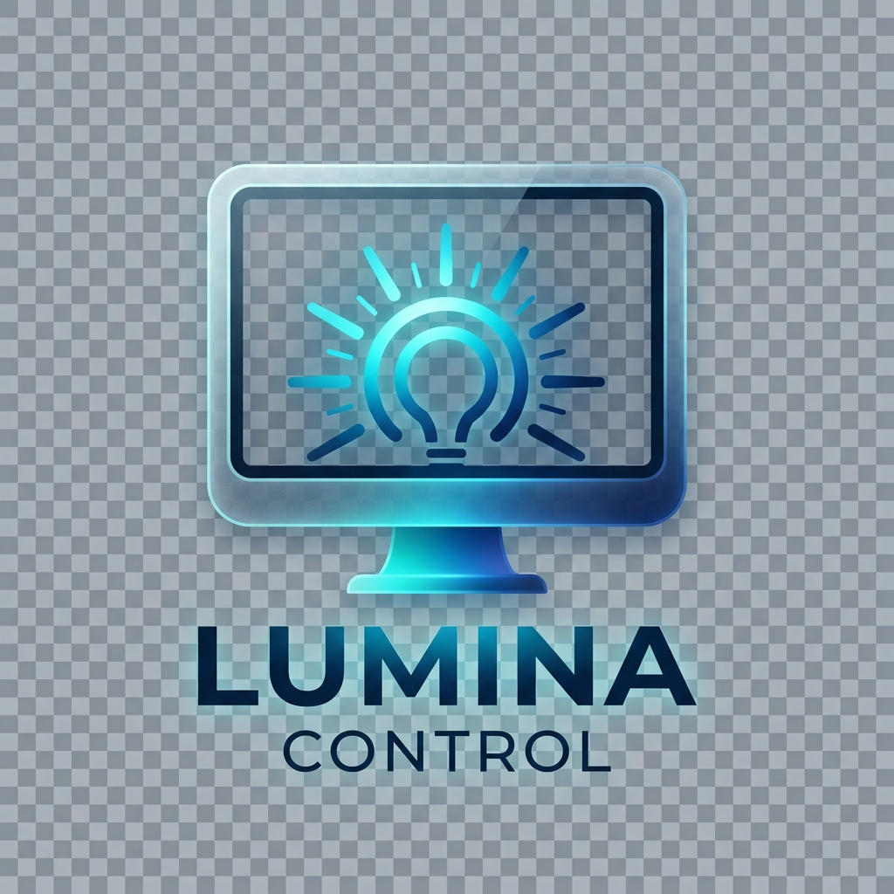
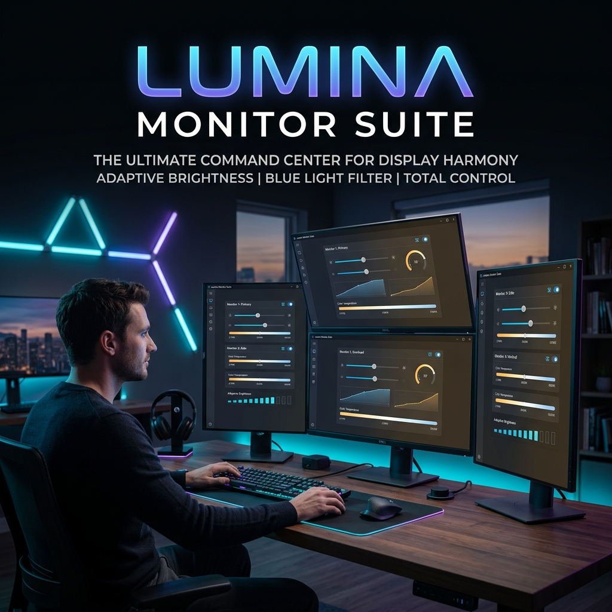

<p align="center">
  
</p>

# 🌟 TAES Brightness (Lumina Control)
> **Premium Multi-Monitor Brightness & Display Management Professional Suite**  
> *Gelişmiş Çoklu Monitör Parlaklık ve Ekran Yönetimi Yazılımı*



---

## 📖 Hakkında / About

**TAES Brightness**, Windows işletim sisteminde birden fazla monitörü olan kullanıcılar için geliştirilmiş, yüksek performanslı ve premium bir ekran yönetim aracıdır. Sadece parlaklık değil; mavi ışık filtresi, uygulama bazlı otomasyon ve gelişmiş monitör hafıza sistemini tek bir şık arayüzde birleştirir.

**TAES Brightness** is a high-performance, premium display management tool specifically designed for Windows users with multi-monitor setups. It combines brightness control, blue light filters, app-based automation, and an advanced monitor persistence system into one sleek, professional interface.

---

## ✨ Özellikler / Features

### 🖥️ Çoklu Monitör Yönetimi / Multi-Monitor Control
- **TR:** Her monitörü ayrı ayrı veya gruplayarak kontrol edin. Kapatılan monitörlerin ayarlarını hafızada tutan "Persistence" modu.
- **EN:** Control each monitor individually or in groups. Support for "Monitor Persistence" mode which remembers settings for disconnected/reconnected displays.

### 🌙 Mavi Işık Filtresi / Blue Light Filter (Night Mode)
- **TR:** Göz yorgunluğunu azaltmak için yazılımsal sıcaklık katmanı. Gece/gündüz döngüsü için zamanlanmış geçişler.
- **EN:** Software-based temperature layer to reduce eye strain. Scheduled transitions for day and night cycles.

### ⌨️ Global Kısayollar / Global Hotkeys
- **TR:** `Ctrl + Alt + Up/Down` ile herhangi bir penceredeyken parlaklığı anında değiştirin.
- **EN:** Instantly adjust brightness from anywhere using `Ctrl + Alt + Up/Down` keyboard shortcuts.

### 🤖 Akıllı Otomasyon / Smart Automation
- **TR:** Uygulama bazlı parlaklık profilleri. Örneğin; oyun başladığında otomatik parlama, film izlerken otomatik kararma.
- **EN:** App-aware brightness profiles. Auto-brighten during gaming, or auto-dim while watching movies.

### 🎨 Premium Arayüz / Premium UI
- **TR:** Modern, karanlık tema destekli ve kullanıcı dostu React/Electron tabanlı arayüz.
- **EN:** Modern, dark-mode ready, and user-friendly interface built with React & Electron.

---

## 🛠️ Teknoloji Yığını / Tech Stack

- **Framework:** [Electron](https://www.electronjs.org/)
- **Frontend:** [React](https://reactjs.org/) + [Vite](https://vitejs.dev/)
- **Language:** [TypeScript](https://www.typescriptlang.org/)
- **Styling:** Custom Vanilla CSS (Premium Dark Theme)
- **Backend/Logic:** Native Windows APIs for Display Control

---

## 🚀 Kurulum / Installation

### Geliştiriciler İçin / For Developers

1. Projeyi klonlayın / Clone the repository:
   ```bash
   git clone https://github.com/User/TAES-Brightness.git
   ```

2. Bağımlılıkları yükleyin / Install dependencies:
   ```bash
   npm install
   ```

3. Geliştirme modunda çalıştırın / Run in development mode:
   ```bash
   npm run dev
   ```

4. Üretim için derleyin / Build for production:
   ```bash
   npm run build
   ```

---

## 📸 Ekran Görüntüleri / Screenshots

> *Premium UI screenshots will be added here.*  
> *Gelişmiş arayüz ekran görüntüleri buraya eklenecektir.*

---

## 📄 Lisans / License

Bu proje **MIT Lisansı** ile lisanslanmıştır. Daha fazla bilgi için `LICENSE` dosyasına göz atın.  
This project is licensed under the **MIT License**. See the `LICENSE` file for details.

---

<p align="center">
  Made with ❤️ by TAES Team
</p>
